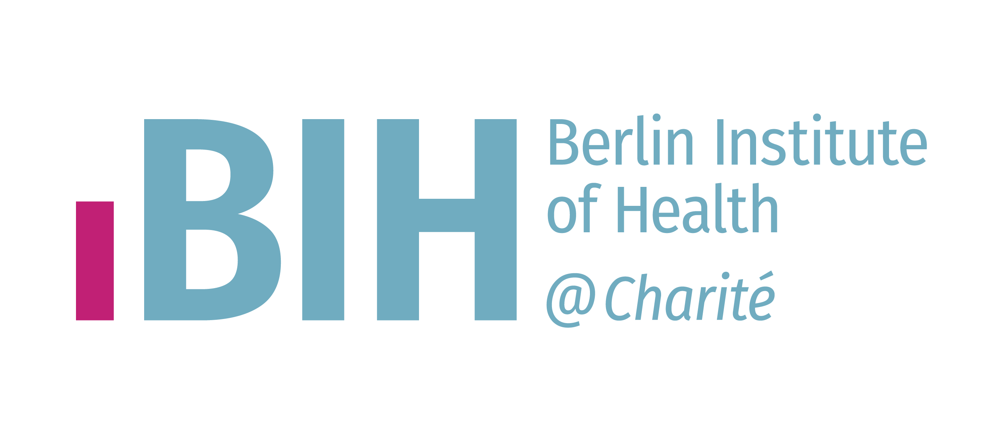

For more information, please email [Lisa Schaak](mailto:lisa.schaak@bih-charite.de).

The summer school is organized by the [Research Group Cloud & IT](https://www.hidih.org/research/health-data) of the [Institute of Digital Health](https://www.bihealth.org/en/notices/eils-lab-bih-digital-health-center) at the

It is part of the [German Center of Competence in Cloud Computing for Data Management and Data Processing](https://datenkompetenz.cloud/) (de.KCD) which stems from the [German Network for Bioinformatics Infrastructure](https://www.denbi.de/about) (de.NBI) and is funded by the [German Federal Ministry of Education and Research](https://www.bildung-forschung.digital/digitalezukunft/de/wissen/Datenkompetenzen/datenkompetenzzentren_f%C3%BCr_die_wissenschaft_ordner/projekte_dkz/dekcd/dekcd.html) (BMBF) 

and the [European Union](https://next-generation-eu.europa.eu/index_de#make-it-digital) (NextGenerationEU)

*Funded by the European Union - Next Generation EU. Views and opinions expressed are however those of the author(s) only and do not necessarily reflect those of the European Union or the European Commission. Neither the European Union nor the European Commission can be held responsible for them.*

