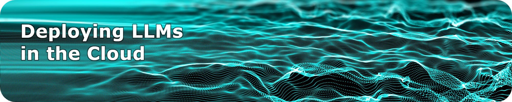

 <b>Summer School</b> ⬤ <b> de.NBI Cloud</b> ⬤ <b> Large Language Models</b> ⬤ <b> September 16-20, 2024</b> ⬤ <b> Online</b> 

  <b><a href="https://events.hifis.net/event/1712">>> Register here <<</a></b>

### About

Ever wanted to look behind the – technical and organizational – scenes of large language models? Already have your own AI research project sketched out but unsure of how to actually get started? Looking for cloud storage to power up your LLM but getting caught up in regulatory requirements?

This summer school will provide practical answers by working with you on your own hands-on sample LLM in the [de.NBI cloud](https://www.denbi.de/cloud). It is part of the [de.KCD](https://datenkompetenz.cloud/) project which aims to systematize and share the unique competence and knowledge of the de.NBI community – e.g., with regard to difficult topics such as handling sensitive data – across different sites and disciplines. Instead of struggling through the steps on your own and reinventing the AI wheel over and over again, we aim to pool our joint expertise and provide you with a shared, tried-and-tested workflow for cutting-edge research.

Over the course of the week, we will walk you through the entire lifecycle of LLM deployment in the cloud. We will take a deep dive into the individual stages of the “day zero one two operation” concept of software engineering – where day 0 is the planning and design phase (including setting up your cloud access and drafting your data management plan), day 1 is go-live (installing and deploying your LLM), and day 2 is continuous operations (including backups and user authentication).

### Trainers

- **Dr. Sebastian Lobentanzer:** Uni Heidelberg – Biomedical researcher and developer of [BioChatter](https://biochatter.org/)
- **Prof. Dr. Fabian Praßer:** Berlin Institute of Health @ Charité – Head of [Medical Informatics Group](https://www.bihealth.org/en/research/research-group/prasser-lab-medical-informatics)
- **Dr. Jeanne Wilbrandt:** Leibniz Institute on Aging – Fritz Lipmann Institute –  [Data Steward](https://www.leibniz-fli.de/research/good-scientific-practice/data-steward-at-fli)
- **Martin Braun:** Berlin Institute of Health @ Charité – Developer at the [Research Group Cloud & IT](https://www.hidih.org/research/health-data)
- **Jakob Mathis:** Berlin Institute of Health @ Charité – Systems Administrator [Cloud & IT](https://www.hidih.org/research/health-data)
- **Foo Wei Ten:** Berlin Institute of Health @ Charité – Systems Administrator [Cloud & IT](https://www.hidih.org/research/health-data)
- **Lisa Schaak:** Berlin Institute of Health @ Charité - Technical Writer [Cloud & IT](https://www.hidih.org/research/health-data)

### Participants

**Target audience:** Everyone interested in digging into the technical and organizational details of deploying large language models for research via cloud infrastructure. Most of our trainers come from a biomedical and IT background. However, we are looking forward to an interdisciplinary exchange with research-developers and developer-researchers from all kinds of academic disciplines.

**Prerequisites:**  In order to be able to follow the practical exercises, you will need at least basic terminal knowledge. Some experience with programming languages - ideally python, but R, perl, SQL etc. are also fine - and basic knowledge of docker is recommended. We will provide detailed step-by-step instructions in writing throughout and after the workshop.

**Learning goals:** Participants will deploy their own LLM in the de.NBI cloud via a step-by-step guided journey throughout an entire lifecycle from design via deployment to productive operation.

### Content

- **Day 1:** How to Cloud – Introduction, de.NBI Cloud & Project Idea  
    
- **Day 2:** How to Data – Data Management, Data Protection & Data Ethics  
  
- **Day 3:** How to LLM – Installation & Deployment of a Large Language Model 
    
- **Day 4:** How to Service  – Ensuring Continuous Support throughout Operations  
  
- **Day 5:** How to Success –  Real-Life Examples, Q&A and Discussion  

  
### Organizational details

**Dates:** Monday, September 16 - Friday, September 20, 2024.

**Duration:** Monday - Thursday 10.00-12.00 and 13.00-15.00, Friday 10.00 - 13.00

**Location:** Online via Microsoft Teams.

**Contact:** For more information, please email Lisa Schaak, [lisa.schaak@bih-charite.de](mailto:lisa.schaak@bih-charite.de).

**Registration:** Please register via the [events.hifis.net webform](https://events.hifis.net/event/1712) by Monday, September 9, 2024. Participation is limited to a maximum of 40 people. First come, first served. 

**Costs & Benefits:** Registration for the [de.KCD](https://datenkompetenz.cloud/) summer school is free of charge. We will not be able to offer any ECTS credit points but we can provide you with a certificate of attendance upon request. 

*We will continue to update this website until the start of the summer school – stay tuned!*
